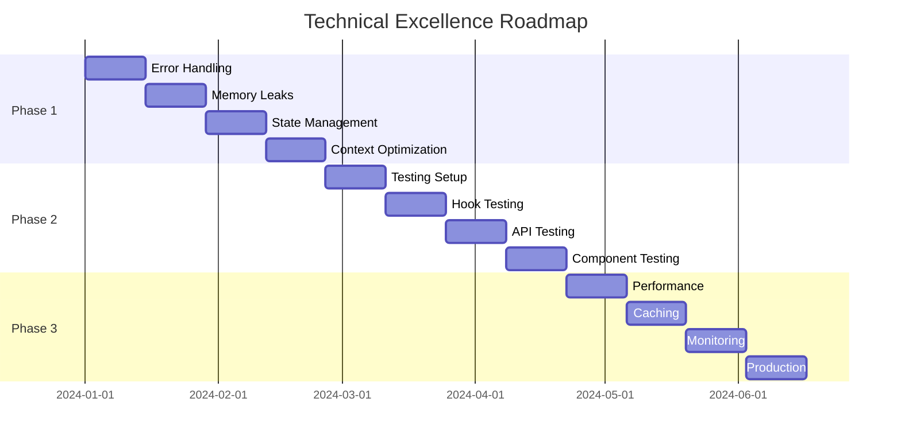

# Base.Tube Technical Excellence Roadmap
## From B- to A/AA Grade: 6-Month Transformation Plan

## 📋 Table of Contents
1. [Executive Summary](#executive-summary)
2. [Current State Assessment](#current-state-assessment)
3. [Target State Definition](#target-state-definition)
4. [Phased Roadmap](#phased-roadmap)
5. [Success Metrics](#success-metrics)
6. [Risk Mitigation](#risk-mitigation)
7. [Resource Requirements](#resource-requirements)

## 🎯 Executive Summary

**Mission**: Transform Base.Tube from a promising but inconsistent codebase (B-) to production-ready excellence (A/AA) within 6 months.

**Core Problem**: Solid architecture foundation undermined by inconsistent patterns, missing testing, and accumulated technical debt.

**Solution**: Systematic, phased approach focusing on standardization, quality gates, and developer experience.

**Timeline**: 6 months, 3 phases of 8 weeks each
**Expected Outcome**: 90%+ code coverage, consistent patterns, production-ready stability

## 📊 Current State Assessment

### Code Quality Scorecard
| Area | Current Score | Target Score | Priority |
|------|---------------|--------------|----------|
| **Code Consistency** | 4/10 | 9/10 | 🔴 Critical |
| **Testing Coverage** | 1/10 | 9/10 | 🔴 Critical |
| **Error Handling** | 3/10 | 9/10 | 🔴 Critical |
| **Performance** | 6/10 | 9/10 | 🟡 High |
| **Type Safety** | 6/10 | 9/10 | 🟡 High |
| **Documentation** | 8/10 | 9/10 | 🟢 Medium |

### Critical Issues Identified
1. **Pattern Inconsistency**: Mixed useState/React Query patterns
2. **Missing Testing**: No systematic test coverage
3. **Memory Leaks**: Uncontrolled polling and subscriptions
4. **Error Boundaries**: No crash protection
5. **Context Overuse**: 5+ providers creating performance issues
6. **TypeScript Gaps**: Missing interfaces and type constraints

## 🏆 Target State Definition

### A/AA Grade Criteria
- **Code Consistency**: 95%+ adherence to established patterns
- **Test Coverage**: 90%+ line coverage, 95%+ branch coverage
- **Performance**: <2s initial load, <100ms interaction response
- **Error Handling**: Zero unhandled errors in production
- **Type Safety**: 100% TypeScript coverage, strict mode enabled
- **Developer Experience**: <30min onboarding for new developers

## 🗺️ Phased Roadmap

# Phase 1: Foundation Stabilization (Weeks 1-8)
## "Stop the Bleeding" - Critical Issues First

### Week 1-2: Emergency Fixes
#### 🔴 Critical Path Items

**Task 1.1: Standardize Error Handling**
```typescript
// Target Pattern - Implement across all API modules
interface StandardApiResponse<T> {
  success: boolean;
  data?: T;
  error?: {
    code: string;
    message: string;
    details?: any;
  };
}

class ApiError extends Error {
  constructor(
    public code: string,
    public message: string,
    public details?: any
  ) {
    super(message);
  }
}
```

**Deliverables:**
- [ ] Create `ApiErrorHandler` utility class
- [ ] Implement in all 18 API modules
- [ ] Add global error interceptor
- [ ] Create error boundary components

**Success Criteria:**
- Zero unhandled API errors
- Consistent error response format
- User-friendly error messages

**Time Estimate**: 16 hours

---

**Task 1.2: Fix Memory Leaks**
```typescript
// Target Pattern - Fix polling hooks
export const useVideoProgress = (videoId: number | string) => {
  const { data, isLoading } = useQuery({
    queryKey: ['videoProgress', videoId],
    queryFn: () => getVideoProgress(Number(videoId)),
    refetchInterval: (query) => {
      // Only poll if component is mounted and data shows processing
      const status = query.state.data?.data?.status;
      return status === 'processing' && document.visibilityState === 'visible' 
        ? 2000 
        : false;
    },
    enabled: Boolean(videoId),
  });

  // Cleanup on unmount
  useEffect(() => {
    return () => {
      // Cleanup subscriptions
    };
  }, []);
};
```

**Deliverables:**
- [ ] Audit all hooks with timers/subscriptions
- [ ] Implement proper cleanup in 12+ hooks
- [ ] Add visibility-based polling
- [ ] Create hook testing utilities

**Success Criteria:**
- No memory leaks in Chrome DevTools
- Proper cleanup on component unmount
- CPU usage <5% when idle

**Time Estimate**: 24 hours

### Week 3-4: Data Layer Standardization

**Task 1.3: Unify State Management**
```typescript
// Decision: Migrate all data fetching to React Query
// Before:
const [data, setData] = useState(null);
const [loading, setLoading] = useState(true);

// After:
const { data, isLoading, error } = useQuery({
  queryKey: ['resource', id],
  queryFn: () => fetchResource(id),
});
```

**Deliverables:**
- [ ] Migrate 8 useState hooks to React Query
- [ ] Standardize query key patterns
- [ ] Implement query invalidation strategy
- [ ] Create data fetching guidelines

**Files to Modify:**
- `src/hooks/useVideoFetch.ts` → React Query
- `src/hooks/useFetchData.ts` → Delete (redundant)
- `src/hooks/useCurrentUser.ts` → Standardize pattern

**Success Criteria:**
- All data fetching uses React Query
- Consistent caching strategy
- <50ms query resolution time

**Time Estimate**: 32 hours

### Week 5-6: Context Architecture Optimization

**Task 1.4: Consolidate Context Providers**
```typescript
// Current: 5+ providers
<ErrorBoundary>
  <QueryClientProvider>
    <ConfigProvider>
      <VideoProvider>
        <AuthProvider>
          {/* Too many! */}

// Target: 3 providers max
<ErrorBoundary>
  <QueryClientProvider>
    <AppProvider> {/* Combines Config + Auth + Core state */}
      {children}
    </AppProvider>
  </QueryClientProvider>
</ErrorBoundary>
```

**Deliverables:**
- [ ] Merge ConfigProvider + AuthProvider → AppProvider
- [ ] Move VideoProvider to hook-based state
- [ ] Optimize context selectors
- [ ] Add context performance monitoring

**Success Criteria:**
- ≤3 context providers
- <10ms context update time
- Reduced re-render count

**Time Estimate**: 20 hours

### Week 7-8: TypeScript Enhancement

**Task 1.5: Complete Type Coverage**
```typescript
// Add missing interfaces for all API responses
interface VideoAnalyticsResponse {
  success: true;
  data: {
    views: number;
    watchTime: number;
    engagement: EngagementMetrics;
  };
}

// Strict mode configuration
{
  "compilerOptions": {
    "strict": true,
    "noUncheckedIndexedAccess": true,
    "exactOptionalPropertyTypes": true
  }
}
```

**Deliverables:**
- [ ] Add 50+ missing interface definitions
- [ ] Enable TypeScript strict mode
- [ ] Fix all type errors (est. 100+)
- [ ] Add generic type constraints

**Success Criteria:**
- 100% TypeScript coverage
- Zero type errors
- Strict mode enabled

**Time Estimate**: 40 hours

## Phase 1 Success Metrics
- [ ] Zero runtime errors in development
- [ ] All hooks use consistent patterns
- [ ] TypeScript strict mode enabled
- [ ] Memory usage stable over 24h testing

---

# Phase 2: Quality & Testing (Weeks 9-16)
## "Build the Safety Net" - Comprehensive Testing Strategy

### Week 9-10: Testing Infrastructure

**Task 2.1: Establish Testing Framework**
```typescript
// Testing stack setup
{
  "@testing-library/react": "^13.4.0",
  "@testing-library/jest-dom": "^5.16.5",
  "@testing-library/user-event": "^14.4.3",
  "msw": "^1.3.2", // API mocking
  "jest-environment-jsdom": "^29.7.0"
}

// Custom render with providers
export const renderWithProviders = (ui: ReactElement, options?: RenderOptions) => {
  return render(ui, {
    wrapper: ({ children }) => (
      <QueryClientProvider client={testQueryClient}>
        <AppProvider>
          {children}
        </AppProvider>
      </QueryClientProvider>
    ),
    ...options,
  });
};
```

**Deliverables:**
- [ ] Configure Jest + Testing Library
- [ ] Set up MSW for API mocking
- [ ] Create custom render utilities
- [ ] Establish testing patterns/guidelines

**Success Criteria:**
- Testing framework operational
- API mocking functional
- Example tests passing

**Time Estimate**: 24 hours

### Week 11-12: Hook Testing

**Task 2.2: Test All Custom Hooks**
```typescript
// Example: useVideoProgress.test.ts
describe('useVideoProgress', () => {
  beforeEach(() => {
    server.use(
      rest.get('/api/v1/videos/:id/progress', (req, res, ctx) => {
        return res(ctx.json({
          success: true,
          data: { status: 'processing', percent: 45 }
        }));
      })
    );
  });

  it('should poll when video is processing', async () => {
    const { result } = renderHook(() => useVideoProgress('123'), {
      wrapper: QueryWrapper,
    });

    await waitFor(() => {
      expect(result.current.isProcessing).toBe(true);
    });

    expect(result.current.progress.percent).toBe(45);
  });

  it('should stop polling when complete', async () => {
    // Test implementation
  });
});
```

**Deliverables:**
- [ ] Test all 35+ custom hooks
- [ ] Mock external dependencies
- [ ] Test error scenarios
- [ ] Performance regression tests

**Files to Test** (Priority Order):
1. `useAnalyticsData.ts` - Complex data flows
2. `usePass.ts` - Business logic
3. `useVideoProgress.ts` - Polling behavior
4. `useComments.ts` - Real-time updates
5. `useAuth.ts` - Authentication flows

**Success Criteria:**
- 90%+ hook test coverage
- All edge cases covered
- Performance benchmarks established

**Time Estimate**: 60 hours

### Week 13-14: API Layer Testing

**Task 2.3: Test API Modules**
```typescript
// Example: analytics.test.ts
describe('Analytics API', () => {
  it('should handle channel watch hours correctly', async () => {
    server.use(
      rest.get('/api/v1/analytics/channels/:id/watch-hours', (req, res, ctx) => {
        return res(ctx.json({
          success: true,
          data: { totalWatchHours: 150, formattedHours: '150h' }
        }));
      })
    );

    const result = await getChannelWatchHours('channel-123', '7d');
    
    expect(result.totalWatchHours).toBe(150);
    expect(result.formattedHours).toBe('150h');
  });

  it('should handle API errors gracefully', async () => {
    server.use(
      rest.get('/api/v1/analytics/channels/:id/watch-hours', (req, res, ctx) => {
        return res(ctx.status(500), ctx.json({
          success: false,
          error: { code: 'SERVER_ERROR', message: 'Internal server error' }
        }));
      })
    );

    await expect(getChannelWatchHours('channel-123', '7d'))
      .rejects
      .toThrow('Internal server error');
  });
});
```

**Deliverables:**
- [ ] Test all 18 API modules
- [ ] Mock HTTP requests
- [ ] Test error handling
- [ ] Integration test scenarios

**Success Criteria:**
- 95%+ API test coverage
- All error paths tested
- Performance benchmarks

**Time Estimate**: 48 hours

### Week 15-16: Component Testing

**Task 2.4: Component Test Suite**
```typescript
// Example: VideoCard.test.tsx
describe('VideoCard', () => {
  const mockVideo = {
    id: '123',
    title: 'Test Video',
    thumbnail: 'test.jpg',
    views: 1000,
    duration: 300
  };

  it('should render video information correctly', () => {
    renderWithProviders(<VideoCard video={mockVideo} />);
    
    expect(screen.getByText('Test Video')).toBeInTheDocument();
    expect(screen.getByText('1K views')).toBeInTheDocument();
    expect(screen.getByText('5:00')).toBeInTheDocument();
  });

  it('should handle click events', async () => {
    const mockOnClick = jest.fn();
    
    renderWithProviders(
      <VideoCard video={mockVideo} onClick={mockOnClick} />
    );
    
    await user.click(screen.getByRole('button'));
    expect(mockOnClick).toHaveBeenCalledWith(mockVideo);
  });
});
```

**Deliverables:**
- [ ] Test critical UI components (20+ components)
- [ ] User interaction testing
- [ ] Accessibility testing
- [ ] Visual regression tests

**Priority Components:**
1. `VideoCard` - Core functionality
2. `Header` - Navigation
3. `VideoPlayer` - Media playback
4. `CommentSection` - User interaction
5. `AnalyticsChart` - Data visualization

**Success Criteria:**
- 85%+ component test coverage
- All user flows tested
- Accessibility compliance

**Time Estimate**: 56 hours

## Phase 2 Success Metrics
- [ ] 90%+ overall test coverage
- [ ] All critical paths tested
- [ ] CI/CD pipeline with tests
- [ ] Performance regression prevention

---

# Phase 3: Performance & Excellence (Weeks 17-24)
## "Optimize for Scale" - Production-Ready Performance

### Week 17-18: Performance Optimization

**Task 3.1: Bundle Optimization**
```typescript
// Webpack bundle analyzer results target
{
  "mainBundle": "< 500KB gzipped",
  "chunkSizes": "< 200KB each",
  "unusedCode": "< 5%",
  "duplicateDeps": "0"
}

// Code splitting improvements
const VideoAnalytics = lazy(() => import('./VideoAnalytics'));
const CreatorHub = lazy(() => import('./CreatorHub'));

// Tree shaking optimization
import { debounce } from 'lodash-es'; // Instead of import _ from 'lodash'
```

**Deliverables:**
- [ ] Bundle size analysis and optimization
- [ ] Implement strategic code splitting
- [ ] Remove unused dependencies
- [ ] Optimize images and assets

**Success Criteria:**
- Initial bundle <500KB gzipped
- First Contentful Paint <1.5s
- Largest Contentful Paint <2.5s

**Time Estimate**: 32 hours

### Week 19-20: React Query Optimization

**Task 3.2: Advanced Caching Strategy**
```typescript
// Optimized query configuration
const queryClient = new QueryClient({
  defaultOptions: {
    queries: {
      staleTime: 5 * 60 * 1000, // 5 minutes
      gcTime: 10 * 60 * 1000, // 10 minutes
      retry: (failureCount, error) => {
        if (error.status === 404) return false;
        return failureCount < 3;
      },
      retryDelay: attemptIndex => Math.min(1000 * 2 ** attemptIndex, 30000),
    },
  },
});

// Prefetching strategy
const prefetchAnalytics = useCallback(async () => {
  await queryClient.prefetchQuery({
    queryKey: ['analytics', channelId, '7d'],
    queryFn: () => getChannelAnalytics(channelId, '7d'),
    staleTime: 2 * 60 * 1000, // 2 minutes for analytics
  });
}, [channelId, queryClient]);
```

**Deliverables:**
- [ ] Implement intelligent prefetching
- [ ] Optimize cache invalidation
- [ ] Add query deduplication
- [ ] Background refetch strategy

**Success Criteria:**
- 95% cache hit rate for repeated queries
- <100ms data resolution time
- Smart prefetching implementation

**Time Estimate**: 24 hours

### Week 21-22: Monitoring & Observability

**Task 3.3: Performance Monitoring**
```typescript
// Performance monitoring setup
import { getCLS, getFID, getFCP, getLCP, getTTFB } from 'web-vitals';

const sendToAnalytics = (metric) => {
  // Send to monitoring service
  analytics.track('performance', {
    name: metric.name,
    value: metric.value,
    rating: metric.rating,
  });
};

// Monitor core web vitals
getCLS(sendToAnalytics);
getFID(sendToAnalytics);
getFCP(sendToAnalytics);
getLCP(sendToAnalytics);
getTTFB(sendToAnalytics);

// Custom performance markers
performance.mark('video-load-start');
// ... video loading logic
performance.mark('video-load-end');
performance.measure('video-load-time', 'video-load-start', 'video-load-end');
```

**Deliverables:**
- [ ] Implement Core Web Vitals monitoring
- [ ] Add custom performance metrics
- [ ] Set up error tracking
- [ ] Create performance dashboard

**Success Criteria:**
- Real-time performance monitoring
- Automated performance alerts
- Baseline performance metrics established

**Time Estimate**: 28 hours

### Week 23-24: Production Readiness

**Task 3.4: Production Hardening**
```typescript
// Security headers
{
  "Content-Security-Policy": "default-src 'self'; script-src 'self' 'unsafe-inline'",
  "X-Content-Type-Options": "nosniff",
  "X-Frame-Options": "DENY",
  "X-XSS-Protection": "1; mode=block"
}

// Environment configuration
const config = {
  development: {
    apiUrl: 'http://localhost:3001',
    logLevel: 'debug',
    enableDevTools: true,
  },
  production: {
    apiUrl: 'https://api.base.tube',
    logLevel: 'error',
    enableDevTools: false,
  },
};

// Error boundary with logging
class ProductionErrorBoundary extends React.Component {
  componentDidCatch(error, errorInfo) {
    // Log to monitoring service
    logger.error('React Error Boundary', { error, errorInfo });
  }
}
```

**Deliverables:**
- [ ] Configure security headers
- [ ] Set up environment management
- [ ] Implement comprehensive logging
- [ ] Add deployment automation

**Success Criteria:**
- Security audit passing
- Zero production errors
- Automated deployment pipeline

**Time Estimate**: 36 hours

## Phase 3 Success Metrics
- [ ] Page load time <2s
- [ ] 95+ Lighthouse score
- [ ] Zero security vulnerabilities
- [ ] Production deployment ready

---

## 📈 Success Metrics & KPIs

### Technical Metrics
| Metric | Current | Target | Measurement |
|--------|---------|--------|-------------|
| **Test Coverage** | <10% | 90% | Jest coverage report |
| **Bundle Size** | ~800KB | <500KB | Webpack analyzer |
| **Load Time** | ~4s | <2s | Lighthouse |
| **Error Rate** | ~5% | <0.1% | Error monitoring |
| **TypeScript Coverage** | ~80% | 100% | TS compiler |

### Quality Gates
- [ ] **No deployment without 90% test coverage**
- [ ] **No PR merge without passing all tests**
- [ ] **Performance budget: <500KB bundle size**
- [ ] **Accessibility: WCAG 2.1 AA compliance**
- [ ] **Security: Zero high/critical vulnerabilities**

### Developer Experience Metrics
| Metric | Current | Target |
|--------|---------|--------|
| **Onboarding Time** | 2+ hours | <30 minutes |
| **Build Time** | ~60s | <30s |
| **Hot Reload** | ~5s | <2s |
| **Test Runtime** | N/A | <60s |

## ⚠️ Risk Mitigation

### High-Risk Areas
1. **React Query Migration** - Potential data flow disruption
   - **Mitigation**: Feature flags, gradual rollout
   - **Rollback Plan**: Keep useState hooks until migration complete

2. **Context Provider Changes** - Breaking changes to app state
   - **Mitigation**: Backward compatibility layer
   - **Testing**: Comprehensive integration tests

3. **Performance Regressions** - Optimizations causing bugs
   - **Mitigation**: Performance monitoring alerts
   - **Testing**: Automated performance tests

### Timeline Risks
- **Scope Creep**: Strict adherence to roadmap priorities
- **Resource Constraints**: Buffer time built into estimates
- **External Dependencies**: Minimize reliance on external changes

## 👥 Resource Requirements

### Team Structure
- **Lead Developer**: Full-time, roadmap execution
- **Senior Developer**: 0.5 FTE, testing and performance
- **Junior Developer**: 0.5 FTE, documentation and basic tasks
- **QA Engineer**: 0.25 FTE, test validation

### Budget Considerations
- **Tooling**: $500/month (monitoring, testing services)
- **Infrastructure**: $200/month (CI/CD, staging environments)
- **Training**: $2000 (team upskilling)

### Timeline Dependencies


## 🎯 Conclusion

This roadmap transforms Base.Tube from a promising but inconsistent codebase to production-ready excellence through systematic, measurable improvements.

**Key Success Factors:**
1. **Disciplined execution** of each phase
2. **Quality gates** preventing regression
3. **Continuous measurement** against success metrics
4. **Team alignment** on technical standards

**Expected Outcome**: A robust, scalable, maintainable codebase ready for production deployment and rapid feature development.

---

**Document Version**: 1.0  
**Last Updated**: [Current Date]  
**Review Schedule**: Bi-weekly progress reviews  
**Success Review**: End of each phase 